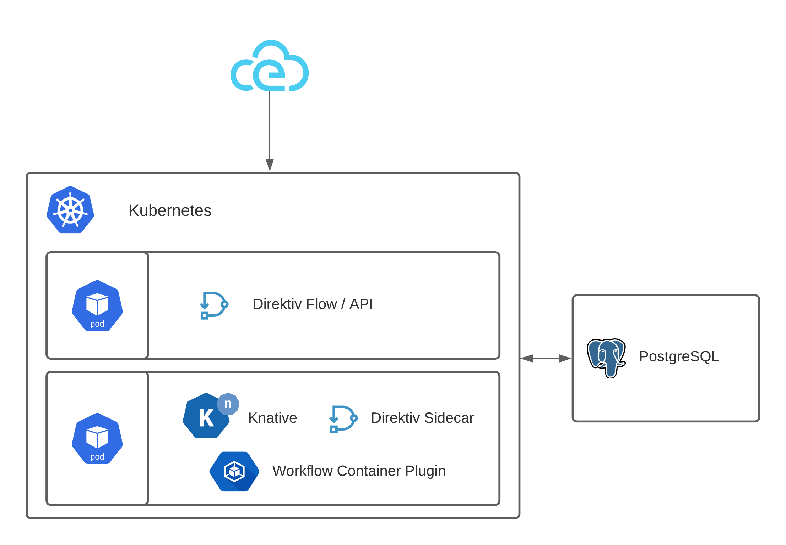

> 原文地址：https://docs.direktiv.io/

[详细内容](./docs/index.md)

## Serverless Container Workflows(无服务器容器工作流)

### direktiv

Direktiv 是一种无服务器计算工作流语言的规范，其目标是简单而强大。

Direktiv 定义了一组有意选择的原始状态，可以将它们串在一起以创建作者需要的简单或复杂的工作流。 强大的 jq JSON 处理器允许作者实现复杂的控制流逻辑，当结合运行容器作为 Direktiv 工作流的一部分的能力时，几乎可以实现任何逻辑。

工作流可以由 CloudEvents 触发以用于基于事件的解决方案，可以使用 cron 调度来处理周期性任务，并且可以使用 API 为其他所有内容编写脚本。

### 为什么要使用 Direktiv？

Direktiv 旨在解决工作流引擎通常面临的 4 个问题：

* 与云无关：我们希望 Direktiv 在任何平台或云上运行，支持任何代码或功能，并且不依赖于云提供商的服务来运行工作流或执行操作（但显然支持这一切）
* 简单：工作流组件的配置应该比什么都简单。 仅使用 YAML 和 jq，您应该能够表达完成工作流所需的所有工作流状态、转换、评估和操作
* 可重用：如果您要将所有微服务、代码或应用程序组件推送到容器平台中，那么为什么不能够在所有工作流程中重用和标准化这些代码呢？ 我们希望确保您的代码始终保持可重用和可移植性，并且不会绑定到特定的供应商格式或要求（或供应商特定语言）。

Direktiv 在 kubernetes 上作为单个 pod 运行，但每个工作流步骤都可以在系统中的每个 pod 上执行，以在工作流执行期间实现负载平衡和高可用性。 它使用 Knative 将容器作为无服务器工作流操作来执行。

### Direktiv 用例？

Direktiv 的用例范围可以从简单的批处理作业到更复杂的事件驱动的业务工作流。

### 其他
[direktiv.io](https://docs.direktiv.io/)

[vorteil.io](https://github.com/vorteil/vorteil/)

[Godoc](https://godoc.org/github.com/vorteil/direktiv)