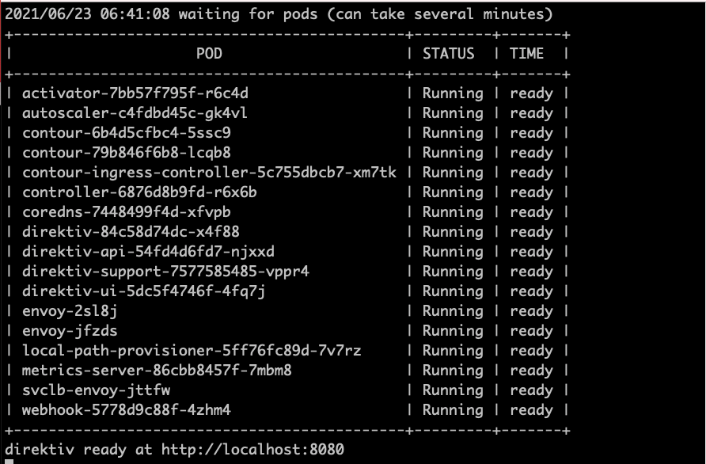

## 快速开始

### 启动服务器

使用 Docker 可以轻松获得本地环境。 以下命令使用 kubernetes 启动一个 docker 容器。 启动时，下载所有图像可能需要几分钟时间。 安装完成后，所有 pod 都应显示“正在运行”或“已完成”。

```
docker run --privileged -p 8080:80 -ti vorteil/direktiv-kube
```

启动成功，如下：



### 测试 Direktiv

从发布页面（包含在 ZIP 文件中）下载 direkcli 命令行工具，并通过运行以下命令创建您的第一个命名空间：

**direkcli 该命令目前需要自行编译**

> direkcli namespaces create demo


```
$ direkcli namespaces create demo
Created namespace: demo
$ direkcli namespaces list
+------+
| NAME |
+------+
| demo |
+------+
```

### Kubernetes 安装

有关如何在预先存在的 Kubernetes 环境中安装的说明，请按照安装[说明](https://docs.direktiv.io/docs/install.html)进行操作。

### 工作流程规范

以下示例是工作流所需的最低配置，遵循[工作流语言规范](https://docs.direktiv.io/docs/specification.html)：

```yml
id: helloworld
states:
- id: hello
  type: noop
  transform: '{ msg: ("Hello, " + .name + "!") }'
```

### 创建和运行工作流

以下脚本执行运行第一个工作流所需的一切。 这包括创建命名空间和工作流并首次运行工作流。

```shell
$ direkcli namespaces create demo
Created namespace: demo
$ cat > helloworld.yml <<- EOF
id: helloworld
states:
- id: hello
  type: noop
  transform: '{ msg: ("Hello, " + .name + "!") }'
EOF
$ direkcli workflows create demo helloworld.yml
Created workflow 'helloworld'
$ cat > input.json <<- EOF
{
  "name": "Alan"
}
EOF
$ direkcli workflows execute demo helloworld --input=input.json (该命令目前执行失败)
Successfully invoked, Instance ID: demo/helloworld/aqMeFX <---CHANGE_THIS_TO_YOUR_VALUE
$ direkcli instances get demo/helloworld/aqMeFX
ID: demo/helloworld/aqMeFX
Input: {
  "name": "Alan"
}
Output: {"msg":"Hello, Alan!"}
```

可使用下面命令处理上面执行失败处：
```shell
direkcli workflows execute demo helloworld input.json
```

### 下一步

有关更复杂的示例，请查看文档的入门部分。